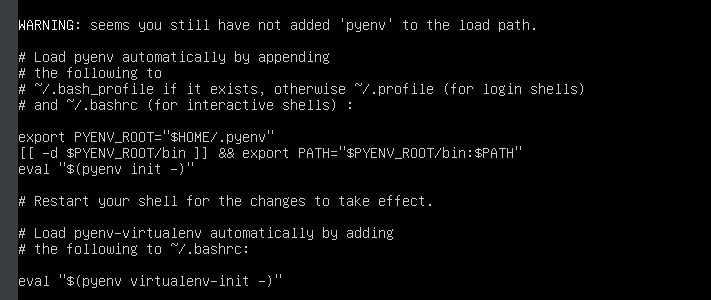

# Using multiple VMs to run parallel code (Cluster of workstations)

We are basically deploying a cluster of workstations to run and test parallel code.

## Stack:
- [Oracle Virtual Box](https://www.virtualbox.org/)
- [Network: Host-Only Adapter and NAT](https://download.virtualbox.org/virtualbox/7.0.14/UserManual.pdf)
- [Ubuntu Server 22.04.3](https://ubuntu.com/download/server)
- [NFS](https://en.wikipedia.org/wiki/Network_File_System)
- [Python 3.11](https://www.python.org/)
- [OpenMPI](https://github.com/open-mpi/ompi)

## Architecture:


## Virtual Machines setup

### Network configuration
First of all, we must create, on Virtual Box, two network interfaces in each Virtual Machine:
- The first one must use the "Host-Only Adapter". This interface is to allow the machines to communicate between each other using _Static IP Addresses_.
- And the second one should use NAT. This interface is necessary to virtual machines communicate with the Internet.

On each virtual machine, we must configure an Static IP Address for the first interface and configure DHCP to the second one (NAT interface).

To identify the interfaces just run:
```sh
ls /sys/class/net
```

Then...
```sh
cd /etc/netplan
sudo cp 00-installer-config.yaml 00-installer-config.yaml.old
sudo vim 00-installer-config.yaml
```

Within the _00-installer-config.yaml_ you must define a YAML configuring the desired configuration.

> You must change the interface names and the IP address as needed.

```yaml
network:
	ethernets:
		enp0s3:
			dhcp4: false
			addresses: [192.168.56.101/24]
		enp0s8:
			dhcp4: true
			nameservers:
				addresses: [1.1.1.1,8.8.8.8]
```

Finally, just apply the changes and you can check the changes:
```sh
sudo netplan apply
ifconfig
```

When you have the network configuration configured in all the virtual machines you can change the hostname of each machine and change the _/etc/hosts_ file:

> Here, you can put meaninfull names. Like, primary, secondary1, secondary2, etc.

```sh
sudo vim /etc/hostname
```

Then, you can set the hostname VS ip address in the _/etc/hosts_ file and then restart the vm.

```sh
sudo vim /etc/hosts
```

```conf
# workstation cluster
192.168.56.101	secondary1
192.168.56.102	secondary2
192.168.56.103	secondary3
192.168.56.200	primary
```

### Creating user for OpenMPI

We must create a new user to be used by OpenMPI.

```sh
sudo adduser mpihpc --uid 7777
sudo usermod -aG sudo mpihpc
```

Then, you must login with this new user and create a SSH key.

> You must keep the SSH key without password.

```sh
su - mpihpc
ssh-keygen -t rsa -b 4096
```

Now, you must send this key to the others virtual machines. For example, if you are using the _primary_, we commands you should run are:
```sh
su - mpihpc
ssh-copy-id secondary1
ssh-copy-id secondary2
ssh-copy-id secondary3
```

> Note that to run ssh-copy-id command, the user mpihpc should be created in all the vms.

To try the connection you must run the command below. Note that it shouldn't ask you for the password.
```sh
ssh <hostname>
```

### NFS server

We must configure a NFS server in the _primary_ vm and NFS client on the _secondaries_.

__On the primary__, we should install _nfs-kernel-server_:

```sh
su - mpihpc
sudo apt-get install nfs-kernel-server
```

Then, you should create a folder called _shared_ on _/home/mpihpc/_ and then configure this folder has a shared storage available in the LAN:
```sh
su - mpihpc
mkdir shared
sudo vim /etc/exports
exportfs -a
```

This is the content to put inside _exportfs -a_
```conf
/home/mpihpc/shared *(rw,sync,no_root_squash,no_subtree_check)
```

Restart NFS service:
```sh
sudo service nfs-kernel-server restart
```

To show the shared folders run:
```sh
exportfs -s
```

### NFS client

__On each secondary__, we should install _nfs-common_:
```sh
su - mpihpc
sudo apt-get install nfs-common
```

Create the _shared_ folder, the same way we did on primary, and then map it on _/etc/fstab_.
```sh
su - mpihpc
mkdir shared
sudo vim /etc/fstab
```

This is the content to put inside _/etc/fstab_:
```conf
primary:/home/mpihpc/shared /home/mpihpc/shared nfs
```

Finally, we just mount the volumes using this command:
```sh
sudo mount -a
```

To check if it worked just run the command below. You should be able to see the _/home/mpihpc/shared_ folder.
```sh
df -h
```

### Installing Python
- [Installing Pyenv](https://github.com/pyenv/pyenv?tab=readme-ov-file#unixmacos) to control Python versions (multi versions)
```sh
curl https://pyenv.run | bash
```

> Note that after the installation, you must add pyenv on PATH. Follow the structure of the documentation to do that.



Checking if everything was installed:
```sh
pyenv --version
```

- Then, it's necessary also to install extra packages to be used by Pyenv:

```sh
sudo apt update
sudo apt install \
    build-essential \
    curl \
    libbz2-dev \
    libffi-dev \
    liblzma-dev \
    libncursesw5-dev \
    libreadline-dev \
    libsqlite3-dev \
    libssl-dev \
    libxml2-dev \
    libxmlsec1-dev \
    llvm \
    make \
    tk-dev \
    wget \
    xz-utils \
    zlib1g-dev
```

- Installing an specific Python version:
```sh
pyenv install 3.11.8
```

Configure the global version to be used
```sh
pyenv global 3.11.8
```

This way you can check the installed Python versions
```sh
pyenv versions
```

And here you can check the current Python version (it must match with the previous command).
```sh
python --version
```

- Installing Python packages:
```sh
python -m pip install mpi4py
python -m pip install click
```


### OpenMPI

__In all machines__, we must install the OpenMPI library.
```sh
sudo apt-get install openmpi-bin openmpi-common libopenmpi-dev
```


__On the primary__, we must install the OpenMPI library.
... and must create a _.cluster_hostfile_ to be used by OpenMPI.
```sh
su - mpihpc
cat <<EOT >> /home/mpihpc/.cluster_hostfile
primary slots=3
secondary1 slots=1
secondary2 slots=1
secondary3 slots=1
EOT
```

> The slots represents the quantity of vCores available in each VM.
